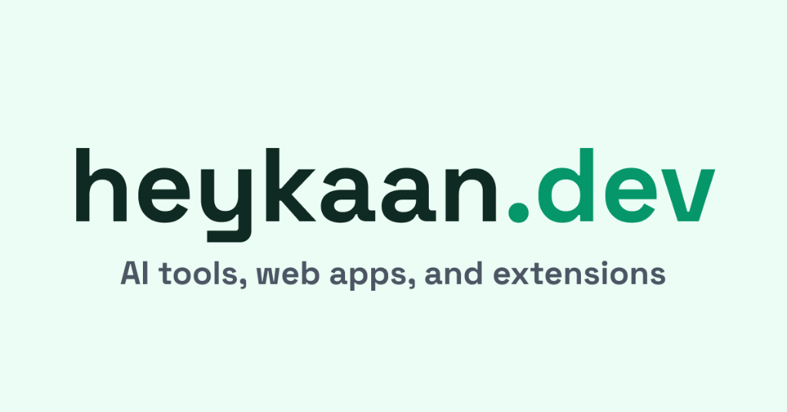

# heykaan.dev

<div align="center">
  
  <p align="center">
    <strong>Chrome extensions and developer tools for the modern web</strong><br>
    <em>Explore readability analysis, UX heatmaps and smart visual redaction tools built to analyze web content in your browser.</em>
  </p>
  <p align="center">
    <a href="https://heykaan.dev"><strong>Live Site</strong></a> •
    <a href="#projects"><strong>Projects</strong></a> •
    <a href="#tech-stack"><strong>Tech Stack</strong></a> •
    <a href="#seo--performance"><strong>SEO & Performance</strong></a>
  </p>
</div>

---

## Overview

**heykaan.dev** is a minimal, performance-first platform designed to showcase functional web tools. Built with a focus on **lightweight architecture** and **clean UI philosophy**, it serves as the home for my browser extensions and experimental web projects.

### Core Philosophy
- **Privacy First**: No tracking, all logic runs locally where possible.
- **Visual Excellence**: Modern aesthetics featuring glassmorphism and smooth micro-interactions.
- **Extreme Performance**: Zero-bloat approach with optimized Core Web Vitals.
- **Universal Accessibility**: Semantic HTML and multi-mode theming support.

---

## Projects

### Browser Extensions
| Icon | Project | Description | Status |
| :---: | :--- | :--- | :--- |
|  | **[Soft Blackout](https://chromewebstore.google.com/detail/soft-blackout/oeefplhfabbdadpicjbgbiapoadppkpo)** | Intelligent redaction modes to hide sensitive content locally. | [Live] |
|  | **[ReadScore](https://chromewebstore.google.com/detail/readscore/ocklmdaccbpakdjnkhckobkoochkajeg)** | Deep readability analysis with transparent SEO/UX metrics. | [Live] |
|  | **[UX HeatGrid](https://chromewebstore.google.com/detail/ux-heatgrid/apdgicimbpoimklcanijmfbpfkekiajn)** | Real-time page attention heatmaps for designers and devs. | [Live] |

### Featured Websites
| Icon | Project | Description | Status |
| :---: | :--- | :--- | :--- |
|  | **[Zanaat.app](https://zanaat.app)** | Interactive AI alchemy experience with stunning visuals. | [Live] |
|  | **[StudyHub](https://github.com/kaanddemir/studyhub)** | A comprehensive personal study dashboard system. | [Repo] |

---

## Tech Stack

- **Frontend**: HTML5, Vanilla JavaScript (ES6+)
- **Styling**: Tailwind CSS (CDN-based for modular simplicity)
- **Typography**: Inter (UI), Space Mono (Code)
- **Deployment**: Static hosting via GitHub Pages

---

## Brand Identity & Palettes

Distinct visual identities for each tool, focused on clarity and contrast:

| Project | Primary Color | Secondary / Accent |
| :--- | :--- | :--- |
| **heykaan.dev** | Emerald Green `#34D399` | Dark Slate `#030F05` |
| **ReadScore** | Deep Blue `#2563EB` | Slate Grey `#94A3B8` |
| **UX HeatGrid** | Amber Gold `#FEBC2E` | Electric Blue `#135BEC` |
| **Soft Blackout** | Minimal Black `#1E1E1E` | Cream White `#F7F5E7` |

---

## Project Structure

```bash
heykaan.dev/
├── index.html              # Main Hub & Portfolio
├── readscore.html          # ReadScore Product Page
├── soft-blackout.html      # Soft Blackout Product Page
├── ux-heatgrid.html        # UX HeatGrid Product Page
├── 404.html                # Custom Branding Error Page
├── manifest.json           # PWA Configuration
├── sitemap.xml             # Search Engine Optimization
├── robots.txt              # Crawler Directives
└── assets/                 # Centralized Media Repository
    ├── icons/              # Logic & Meta Icons
    └── images/             # Product Showcase Logos
```

---

## SEO & Performance

Engineered for speed and discoverability, achieving top-tier scores across all primary metrics:

- **Performance (100/100)**: Resource preloading, DNS prefetching, and lazy-loading for all media.
- **Accessibility (100/100)**: High-contrast support and ARIA-compliant semantic structures.
- **SEO (100/100)**: Structured data (Schema.org), canonical mapping, and optimized meta-tags.
- **Security**: Robust CSP headers and XSS/Clickjacking protections implemented via meta-tags.

---

## Local Development

To preview the site locally, clone the repository and run a simple HTTP server:

```bash
# Clone
git clone https://github.com/kaanddemir/heykaan.dev.git
cd heykaan.dev

# Run with Python
python -m http.server 8000

# or Node.js
npx http-server
```

---

## License

This project is open-source and released under the [MIT License](LICENSE).

<p align="right">
  Built with love by <strong><a href="https://heykaan.dev">Kaan Demir</a></strong>
</p>
