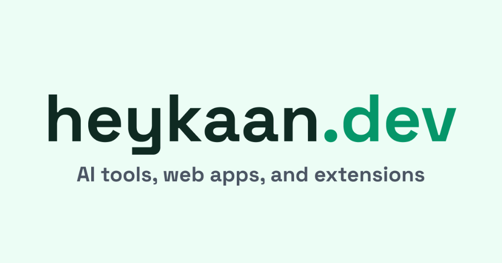
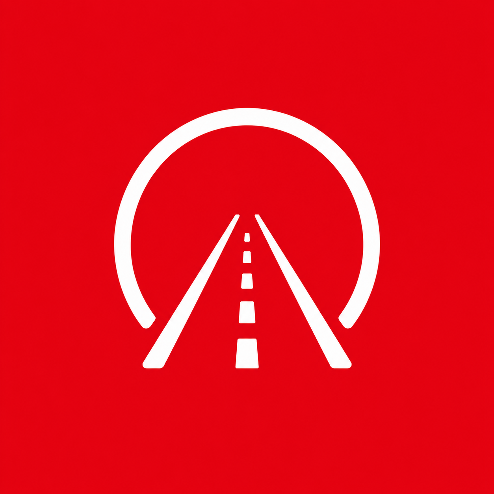

# heykaan.dev

<div align="center">
  
  <p align="center">
    <strong>Recent MIS graduate focused on data analysis</strong><br>
    <em>Dashboards, data projects, and data-driven browser tools. Turning complex datasets into clear, actionable insight with Python, SQL, and Power BI.</em>
  </p>
  <p align="center">
    <a href="https://heykaan.dev"><strong>Live Site</strong></a> •
    <a href="#projects"><strong>Projects</strong></a> •
    <a href="#profile--skills"><strong>Profile & Skills</strong></a> •
    <a href="#contact"><strong>Contact</strong></a>
  </p>
</div>

---

## Overview

**heykaan.dev** is the portfolio and home of Kaan Demir, a recent Management Information Systems graduate focused on data analysis. It brings together data projects, interactive dashboards, and the browser extensions and web applications I build to turn complex data into clear, useful insight.

---

## Projects

### Data & Web Projects
| Icon | Project | Description | Status |
| :---: | :--- | :--- | :--- |
|  | **[StudyHub](https://github.com/kaanddemir/studyhub)** | A comprehensive personal study dashboard system. | [Repo] |
|  | **[Spectra](https://github.com/kaanddemir/spectra-vision)** | A Python/OpenCV driving risk analysis dashboard with object and lane detection. | [Repo] |

### Browser Extensions
| Icon | Project | Description | Status |
| :---: | :--- | :--- | :--- |
|  | **[Soft Blackout](https://chromewebstore.google.com/detail/soft-blackout/oeefplhfabbdadpicjbgbiapoadppkpo)** | Intelligent redaction modes to hide sensitive content locally. | [Live] |
|  | **[ReadScore](https://chromewebstore.google.com/detail/readscore/ocklmdaccbpakdjnkhckobkoochkajeg)** | Readability analysis, AI-powered summaries, and focused reading tools. | [Live] |
|  | **[UX HeatGrid](https://chromewebstore.google.com/detail/ux-heatgrid/apdgicimbpoimklcanijmfbpfkekiajn)** | Real-time page attention heatmaps for designers and devs. | [Live] |
|  | **[TypeFlux](https://chromewebstore.google.com/detail/typeflux/nemkilhkadhfoafhdbmomnoaanodeehh)** | Live typography preview tool for fonts and vertical rhythm. | [Live] |

---

## Profile & Skills

Recent **Management Information Systems** graduate focused on data analysis. Turning complex datasets into clear, actionable insight.

| Area | Skills |
| :--- | :--- |
| **Programming & Databases** | Python, SQL, C# |
| **Data Analytics & Visualization** | Pandas, NumPy, OpenCV, Power BI (DAX), Microsoft Excel |
| **Web** | JavaScript, HTML, CSS |
| **Cloud & Tools** | Microsoft Azure, Google Cloud Platform (GCP), Linux, Git, GitHub |

---

## Brand Identity & Palettes

Distinct visual identities for each tool, focused on clarity and functional contrast:

| Project | Brand Color (Primary) | Accent / Secondary | Primary Background |
| :--- | :--- | :--- | :--- |
| **heykaan.dev** | Emerald Green `#34D399` | Mint Hover `#6EE7B7` | Deep Forest `#030F05` |
| **ReadScore** | Deep Blue `#0040A1` | Sky Blue `#DAE2FF` | Soft Slate `#F0F4F8` |
| **TypeFlux** | Cyan Teal `#06B6D4` | Bright Aqua `#22D3EE` | Slate Space `#0F172A` |
| **UX HeatGrid** | Amber Gold `#FEBC2E` | Heatmap Red `#FF5B3A` | Dark Space `#101622` |
| **Soft Blackout** | Minimal Onyx `#1E1E1E` | Cream White `#F7F5E7` | Absolute Black `#000000` |
| **StudyHub** | Emerald Teal `#0D9488` | Soft Mint `#A7F3D0` | Light Emerald `#F0FDF4` |
| **Spectra** | Crimson Red `#DC2626` | Light Coral `#FECACA` | Light Rose `#FFF1F2` |

---

## Project Structure

```bash
heykaan.dev/
├── index.html              # Root redirect → /main/
├── main/                   # Main hub & portfolio
│   ├── index.html          # Landing page
│   ├── main.css            # Styles
│   └── main.js             # Theme + scroll behavior
├── about/                  # About & profile
│   ├── index.html          # Detailed profile page
│   ├── about.css           # Styles
│   └── about.js            # Theme + scroll behavior
├── readscore/              # ReadScore
│   ├── index.html          # Landing page
│   ├── readscore.css       # Styles
│   └── readscore.js        # Scroll spy + footer year updater
├── typeflux/               # TypeFlux
│   ├── index.html          # Landing page
│   ├── typeflux.css        # Styles
│   └── typeflux.js         # Scroll spy + footer year updater
├── ux-heatgrid/            # UX HeatGrid
│   ├── index.html          # Landing page
│   ├── ux-heatgrid.css     # Styles
│   └── ux-heatgrid.js      # Scroll spy + footer year updater
├── soft-blackout/          # Soft Blackout
│   ├── index.html          # Landing page
│   ├── soft-blackout.css   # Styles
│   └── soft-blackout.js    # Scroll spy + footer year updater + interactive toggle
├── assets/                 # Centralized media repository
│   ├── icons/              # Meta & app icons
│   └── images/             # Project showcase logos
├── manifest.json           # PWA configuration
├── sitemap.xml             # Search engine optimization
├── robots.txt              # Crawler directives
├── 404.html                # Custom not-found page
├── CNAME                   # Custom domain mapping
└── LICENSE                 # MIT License
```

---

## Contact

- **GitHub**: [@kaanddemir](https://github.com/kaanddemir)
- **X (Twitter)**: [@heykaandev](https://x.com/heykaandev)
- **Product Hunt**: [@heykaandev](https://www.producthunt.com/@heykaandev)

---

## License

This project is open-source and released under the [MIT License](LICENSE).

<p align="right">
  Built by <strong><a href="https://heykaan.dev">Kaan Demir</a></strong>
</p>
